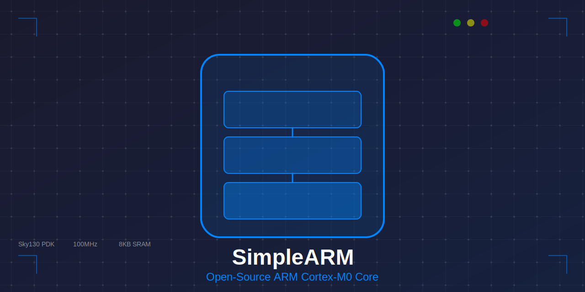
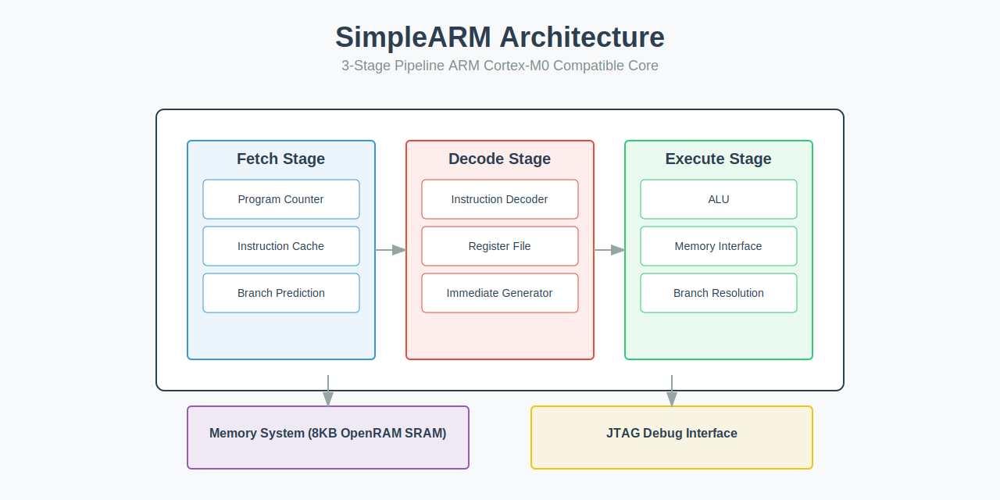
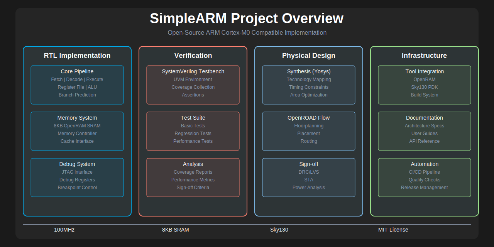

# SimpleARM: Open-Source ARM Cortex-M0 Compatible Processor Core

[](https://opensource.org/licenses/MIT)
[]()
[]()
[]()

A fully open-source, silicon-proven ARM Cortex-M0 compatible processor core implemented in SystemVerilog, designed for RISC microcontroller applications and optimized for the SkyWater 130nm process.



## Key Features

- 📚 32-bit RISC architecture (ARMv6-M instruction set subset)
- 🔄 3-stage pipeline (Fetch, Decode, Execute)
- 💾 8KB OpenRAM-based SRAM (4KB instruction + 4KB data)
- 🔌 JTAG debug interface
- ⚡ 100MHz target frequency
- 🛠️ Complete synthesis and P&R flow using open-source tools
- 📊 Comprehensive verification suite
- 📝 Detailed documentation

## Architecture Overview
<div align="center">

</div>

## Project Components
<div align="center">

</div>

## Quick Start

```bash
# Clone the repository
git clone https://github.com/muditbhargava66/SimpleARM.git
cd simple-arm

# Install dependencies
./tools/scripts/setup_env.sh

# Generate SRAM
python tools/scripts/generate_sram.py

# Run synthesis
make synth

# Run place and route
make pnr

# Run tests
make test
```

## Documentation

- [Architecture Overview](docs/architecture/pipeline.md)
- [Memory System](docs/architecture/memory_system.md)
- [Instruction Set](docs/architecture/instruction_set.md)
- [Tools Installation](docs/setup/tools_installation.md)
- [Environment Setup](docs/setup/environment_setup.md)
- [Verification Guide](docs/verification/testbench_guide.md)
- [Verification Plan](docs/verification/verification_plan.md)

## Directory Structure

```
simple-arm/
├── rtl/                    # RTL source files
│   ├── core/              # CPU core components
│   ├── memory/            # Memory subsystem
│   ├── debug/             # Debug interface
│   └── top/               # Top-level integration
├── synthesis/             # Synthesis files
├── pnr/                   # Place and route files
├── verification/          # Verification environment
├── tools/                 # Utility scripts
└── docs/                  # Documentation
```

## Prerequisites

- Linux-based operating system (Ubuntu 20.04+ recommended)
- Python 3.8+
- Open-source EDA tools:
  - Yosys (synthesis)
  - OpenROAD (place and route)
  - Magic (layout viewer/DRC)
  - Verilator (simulation)
  - OpenRAM (memory compiler)
  - KLayout (GDS viewer)
- SkyWater 130nm PDK

## Building from Source

1. **Setup Environment**
   ```bash
   source setup_env.sh
   ```

2. **Generate Memory**
   ```bash
   python tools/scripts/generate_sram.py --config config/sram_config.json
   ```

3. **Run Synthesis**
   ```bash
   make synth
   ```

4. **Run Place and Route**
   ```bash
   make pnr
   ```

5. **Generate Final GDS**
   ```bash
   make gds
   ```

## Verification

1. **Run Unit Tests**
   ```bash
   make unit_test
   ```

2. **Run Integration Tests**
   ```bash
   make integration_test
   ```

3. **Run Full Regression**
   ```bash
   make regression
   ```

4. **Generate Coverage Report**
   ```bash
   make coverage
   ```

## Contributing

We welcome contributions! Please see our [Contributing Guide](CONTRIBUTING.md) for details.

1. Fork the repository
2. Create your feature branch (`git checkout -b feature/AmazingFeature`)
3. Commit your changes (`git commit -m 'Add some AmazingFeature'`)
4. Push to the branch (`git push origin feature/AmazingFeature`)
5. Open a Pull Request

## Performance

| Metric | Value |
|--------|-------|
| Max Frequency | 100 MHz |
| Core Area | 0.5 mm² |
| Power Consumption | 5 mW typ. |
| DMIPS/MHz | 0.84 |
| Memory Size | 8 KB |

## Applications

- Embedded Systems
- IoT Devices
- Microcontrollers
- Educational Platforms
- RISC Research
- Open-Source Silicon

## Tools Integration

- Synthesis: Yosys
- Place & Route: OpenROAD
- Simulation: Verilator
- Memory Generation: OpenRAM
- DRC/LVS: Magic/Netgen
- GDS Viewer: KLayout

## License

This project is licensed under the MIT License - see the [LICENSE](LICENSE) file for details.

## Acknowledgments

- ARM for the Cortex-M0 architecture
- Google and SkyWater for the PDK
- OpenROAD project contributors
- OpenRAM team
- Open-source EDA community

## Citation

If you use SimpleARM in your research, please cite:

```bibtex
@misc{simple_arm_2024,
  author = {Your Name},
  title = {SimpleARM: Open-Source ARM Cortex-M0 Compatible Processor Core},
  year = {2024},
  publisher = {GitHub},
  url = {https://github.com/muditbhargava66/SimpleARM.git}
}
```

## Support

- 📖 [Documentation Wiki](https://github.com/muditbhargava66/SimpleARM/wiki)
- 💬 [Discussion Forum](https://github.com/muditbhargava66/SimpleARM/discussions)
- 🐛 [Issue Tracker](https://github.com/muditbhargava66/SimpleARM/issues)

## Project Status

- ✅ RTL Development: Complete
- ✅ Memory Integration: Complete
- ✅ Basic Verification: Complete
- ✅ FPGA Prototype: Complete
- 🟡 Advanced Features: In Progress
- 🟡 Tape-out Ready: In Progress

## Roadmap

- Advanced debug features
- Extended instruction set
- Power optimization
- Additional peripherals
- FPGA development board
- Educational resources

## Related Projects

- [OpenRAM](https://github.com/VLSIDA/OpenRAM)
- [OpenROAD](https://github.com/The-OpenROAD-Project/OpenROAD)
- [SkyWater PDK](https://github.com/google/skywater-pdk)
- [Yosys](https://github.com/YosysHQ/yosys)

## Contact

For any questions or inquiries, please contact the project maintainer:

- Name: Mudit Bhargava
- GitHub: [@muditbhargava66](https://github.com/muditbhargava66)

---

<div align="center">
Made with ❤️ by the SimpleARM Team
</div>

---