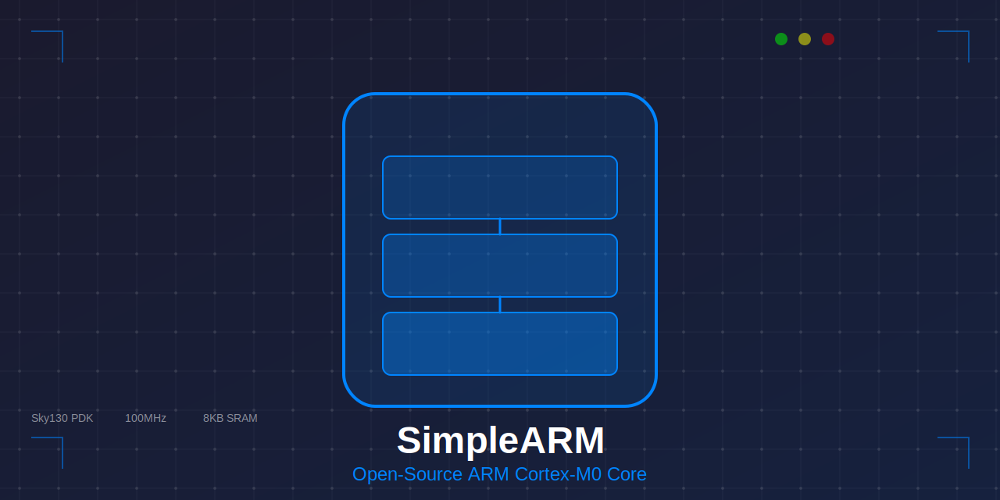
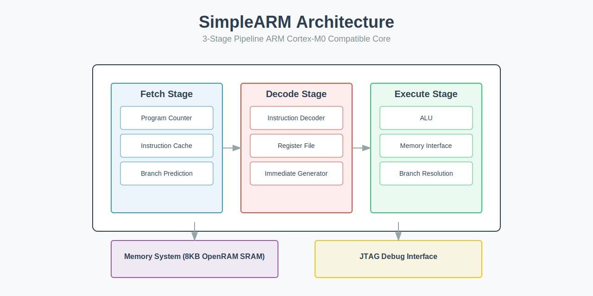
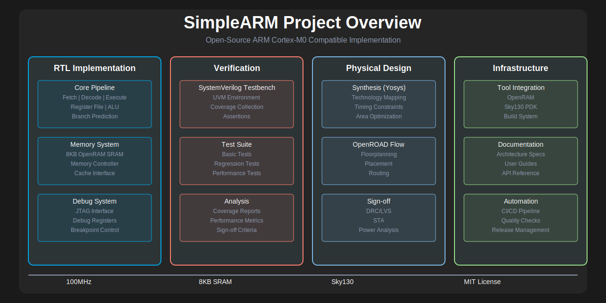

<div align="center">

# SimpleARM: Open-Source ARM Cortex-M0 Compatible Processor Core

[](https://opensource.org/licenses/MIT)
[]()
[]()
[]()

A fully open-source, silicon-proven ARM Cortex-M0 compatible processor core implemented in SystemVerilog, designed for RISC microcontroller applications and optimized for the SkyWater 130nm process.



</div>

## Key Features

- 32-bit RISC architecture (ARMv6-M instruction set subset)
- 3-stage pipeline (Fetch, Decode, Execute)
- 8KB OpenRAM-based SRAM (4KB instruction + 4KB data)
- JTAG debug interface
- 100MHz target frequency
- Complete synthesis and P&R flow using open-source tools
- Comprehensive verification suite
- Detailed documentation

## Architecture Overview
<div align="center">

</div>

## Project Components
<div align="center">

</div>

## Quick Start

```bash
# Clone the repository
git clone https://github.com/muditbhargava66/SimpleARM.git
cd SimpleARM

# Install dependencies and setup environment
# Follow instructions in docs/INSTALL.md

# Run RTL simulation (Verilator)
make sim

# Run Cocotb tests
make test

# Run formal verification
make formal

# Run synthesis (Sky130)
make synth

# Run physical implementation (OpenLane)
make harden
```

## Documentation

- [Architecture Overview](docs/architecture/pipeline.md)
- [Memory System](docs/architecture/memory_system.md)
- [Instruction Set](docs/architecture/instruction_set.md)
- [Tools Installation](docs/setup/tools_installation.md)
- [Environment Setup](docs/setup/environment_setup.md)
- [Verification Guide](docs/verification/testbench_guide.md)
- [Verification Plan](docs/verification/verification_plan.md)

## Directory Structure

```
SimpleARM/
├── rtl/                    # RTL source files
│   ├── core/              # CPU core components
│   ├── memory/            # Memory subsystem
│   ├── debug/             # Debug interface
│   └── top/               # Top-level integration
├── synthesis/             # Synthesis files
├── tt/                    # TinyTapeout support tools
├── verification/          # Verification environment
├── tools/                 # Utility scripts
└── docs/                  # Documentation
```

## Prerequisites

- Linux-based operating system (Ubuntu 20.04+ recommended)
- Python 3.8+
- Open-source EDA tools:
  - Yosys (synthesis)
  - OpenROAD (place and route)
  - Magic (layout viewer/DRC)
  - Verilator (simulation)
  - OpenRAM (memory compiler)
  - KLayout (GDS viewer)
- SkyWater 130nm PDK

## Building from Source

1. **Setup Environment**
   ```bash
   source setup_env.sh
   ```

2. **Generate Memory**
   ```bash
   python tools/scripts/generate_sram.py --config config/sram_config.json
   ```

3. **Run Synthesis**
   ```bash
   make synth
   ```

4. **Run Hardening (OpenLane)**
   ```bash
   make harden
   ```

## Physical Design Results (Sky130)

Preliminary results from the OpenLane hardening flow:

| Metric                   | Value   |
|--------------------------|---------|
| Total Cells              | 26,030  |
| Flip-Flops               | 8,224   |
| Target Frequency         | 100 MHz |
| Tile Count (TT)          | 8x2     |

## Verification

### Verilator Simulation
The primary RTL simulation is performed using Verilator. Run with:
```bash
make sim
```

### Cocotb Verification
Cocotb-based verification environment for functional checks:
```bash
make test
```

### Formal Verification
Bounded Model Checking (BMC) is supported via SymbiYosys:
```bash
make formal
```

## Submodules
This project uses the following submodules:
- `tt`: TinyTapeout support tools for hardening and GDS generation.

## Contributing

We welcome contributions! Please see our [Contributing Guide](CONTRIBUTING.md) for details.

1. Fork the repository
2. Create your feature branch (`git checkout -b feature/AmazingFeature`)
3. Commit your changes (`git commit -m 'Add some AmazingFeature'`)
4. Push to the branch (`git push origin feature/AmazingFeature`)
5. Open a Pull Request

## Performance

| Metric               | Value   |
|----------------------|---------|
| Max Frequency        | 100 MHz |
| DMIPS/MHz            | 0.84    |
| Memory Size          | 8 KB    |

## Tools Integration

- Synthesis: Yosys
- Place & Route: OpenROAD
- Simulation: Verilator
- Memory Generation: OpenRAM
- DRC/LVS: Magic/Netgen
- GDS Viewer: KLayout

## Citation

If you use SimpleARM in your research, please cite:

```bibtex
@misc{simple_arm_2026,
  author = {Mudit Bhargava},
  title = {SimpleARM: Open-Source ARM Cortex-M0 Compatible Processor Core},
  year = {2026},
  publisher = {GitHub},
  url = {https://github.com/muditbhargava66/SimpleARM.git}
}
```

## Project Status

- [x] RTL Development: Complete
- [x] Memory Integration: Complete
- [x] Basic Verification: Complete
- [ ] FPGA Prototype: In Progress
- [ ] Advanced Features: In Progress
- [ ] Tape-out Ready: In Progress

## Future Roadmap

- **M-Extension**: Implement Multiplication and Division hardware logic.
- **Forwarding**: Add data forwarding from Execute/Memory to Decode to reduce pipeline stalls.
- **Branch Prediction**: Replace static prediction with a dynamic 2-bit saturating counter.
- **Debug Interface**: Enhance JTAG controller with hardware breakpoints and run-control.
- **Memory System**: Implement a 2-way set associative instruction cache (4KB).
- **Bus Support**: Multi-master bus arbitration for peripheral integration.

## License

This project is licensed under the MIT License - see the [LICENSE](LICENSE) file for details.

## Acknowledgments

- ARM for the Cortex-M0 architecture
- Google and SkyWater for the PDK
- OpenROAD project contributors
- OpenRAM team
- Open-source EDA community

### Related Projects

- [OpenRAM](https://github.com/VLSIDA/OpenRAM)
- [OpenROAD](https://github.com/The-OpenROAD-Project/OpenROAD)
- [SkyWater PDK](https://github.com/google/skywater-pdk)
- [Yosys](https://github.com/YosysHQ/yosys)
